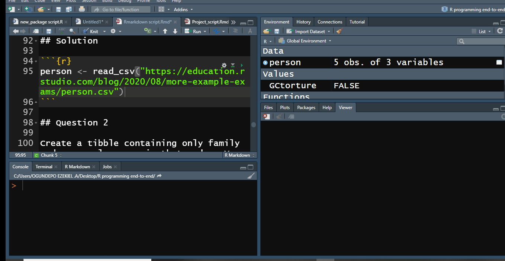

 
<br>
<center>
```{r out.width = "100%", out.height =  "100%", fig.pos = "c", echo = FALSE}

```
</center>
<br>
 
 
```{r setup, include=FALSE}
knitr::opts_chunk$set(echo = TRUE, 
                      tidy = 'styler', 
                      comment = NA,
                      message = FALSE,
                      warning = FALSE, rows.print = 5)
```

# Exam Instructions

The sample exam can be found [here](https://education.rstudio.com/blog/2020/08/more-example-exams/){target="_blank"}.

- This exam covers material from R for Data Science (r4ds) to test your knowledge of the [tidyverse](https://www.tidyverse.org/). You may find the solution provided [here](https://jrnold.github.io/r4ds-exercise-solutions/) for r4ds useful.

- You must use tidy-style operations (e.g., the pipe operator `%>%`) unless instructed otherwise. 

- This file contains several deliberate errors. Please correct them as you go and point out your changes to your examiner.

- You do not need to narrate your work.

- You must complete the exam within 90 minutes.

- You may use any books or digital resources you want during this examination, but you may not communicate with any person other than your examiner.

- You are required to use the RStudio IDE for this exam. You may use either the desktop edition or rstudio.cloud as you prefer.

# Load packages

This program will download from the internet and install the latest version of the tidyverse set of packages if they are not already installed in your R environment. It is necessary to have internet connection to download those packages. 

```{r packages}

if (!require(install.load)) {
  install.packages("install.load")
}

install.load::install_load("tidyverse")

# Set default ggplot2 theme to theme_bw()
theme_set(theme_bw())
```

To see the list of all packages in the tidyvserse use: 

```{r tidyverse packages}
tidyverse_packages()
```

# Basic Operations

## Question 1 {.tabset .tabset-fade .tabset-pills}


### Question 

Read the file [person.csv](https://education.rstudio.com/blog/2020/08/more-example-exams/person.csv) and store the result in a tibble called `person`.

### Solution

```{r}
person <- read_csv("https://education.rstudio.com/blog/2020/08/more-example-exams/person.csv")

person
```
The function `display_data()` with the help of `vtable` package output a descriptive variable table as an HTML file that can be viewed continuously while working with data and the first 6 rows of the data is also shown on the console. This is helpful when working with the data, otherwise we will be typing `glimpse(person)` or `View(person`) to view the data every time.

```{r}
# Display the structure of the dataframe

display_data <- function(df, title = "Data structure"){
  
  require(vtable)
  
  if(is.data.frame(df) == FALSE){
    stop("Display_data() only works for dataframe object")
  }else{
    df %>%
      mutate(across(where(is.character), as.factor)) %>%
      vtable(factor.limit = 10, data.title = title)
    cat("Returns the First 6 rows\n")
    print(head(df))
  }
  
}
```




## Question 2 {.tabset .tabset-fade .tabset-pills}


### Question 

Create a tibble containing only family and personal names, in that order. You do not need to assign this tibble or any others to variables unless explicitly asked to do so. However, as noted in the introduction, you must use the pipe operator `%>%` and code that follows the tidyverse style guide.

### Solution

```{r}
person %>% select(family_name, personal_name)
```

## Question 3 {.tabset .tabset-fade .tabset-pills}

### Question 

Create a new tibble containing only the rows in which family names come before the letter `M`. Your solution should work for tables with more rows than the example, i.e., you cannot rely on row numbers or select specific names.

### Solution

```{r}
person %>% arrange(str_starts(family_name, pattern = "M", negate = TRUE))
```

## Question 4 {.tabset .tabset-fade .tabset-pills}

### Question

Display all the rows in `person` sorted by family name length with the longest name first.

### Solution

```{r}
person %>% arrange(desc(str_length(family_name)))
```


# Cleaning and Counting 

## Question 1 {.tabset .tabset-fade .tabset-pills}

### Question

Read the file [measurements.csv](https://education.rstudio.com/blog/2020/08/more-example-exams/measurements.csv) to create a tibble called `measurements.` (The strings `"rad"`, `"sal"`, and `"temp"` in the `quantity` column stand for “radiation”, “salinity”, and “temperature” respectively.)

### Solution

```{r}
measurements <- read_csv("https://education.rstudio.com/blog/2020/08/more-example-exams/measurements.csv")

measurements 
```


## Question 2 {.tabset .tabset-fade .tabset-pills}

### Question

Create a tibble containing only rows where none of the values are `NA` and save in a tibble called `cleaned`.

### Solution

```{r}
cleaned <-  measurements %>% 
  drop_na()

cleaned
```

## Question 3 {.tabset .tabset-fade .tabset-pills}

### Question

Count the number of measurements of each type of quantity in `cleaned`. Your result should have one row for each quantity `"rad"`, `"sal"`, and `"temp"`.

### Solution

```{r}
cleaned %>% count(quantity)
```


## Question 4 {.tabset .tabset-fade .tabset-pills}

### Question

Display the minimum and maximum value of `reading` separately for each quantity in `cleaned`. Your result should have one row for each quantity `"rad"`, `"sal"`, and `"temp"`.

### Solution

```{r}
cleaned %>% group_by(quantity) %>% summarise(across(reading, list(Min = min, Max = max)))
```

## Question 5 {.tabset .tabset-fade .tabset-pills}

### Question

Create a tibble in which all salinity `("sal")` readings greater than 1 are divided by 100. (This is needed because some people wrote percentages as numbers from 0.0 to 1.0, but others wrote them as 0.0 to 100.0.)

### Solution

```{r}
cleaned %>% mutate(reading = case_when(
  quantity == "sal" & reading > 1 ~ reading/100,
  TRUE ~ reading
))
```

# Combining Data 

## Question 1 {.tabset .tabset-fade .tabset-pills}

### Question

Read [visited.csv](https://education.rstudio.com/blog/2020/08/more-example-exams/visited.csv) and drop rows containing any `NAs`, assigning the result to a new tibble called `visited`.

### Solution

```{r}
visited <- read_csv("https://education.rstudio.com/blog/2020/08/more-example-exams/visited.csv") %>% 
  drop_na()

visited 
```

## Question 2 {.tabset .tabset-fade .tabset-pills}

### Question

Use an inner join to combine `visited` with `cleaned` using the `visit_id` column for matches.

### Solution

```{r}
combined_data <-  visited %>% inner_join(cleaned, by = "visit_id")

combined_data 
```

## Question 3 {.tabset .tabset-fade .tabset-pills}

### Question

Find the highest radiation `("rad")` reading at each site. (Sites are identified by values in the `site_id` column.)

### Solution

```{r}
combined_data %>% filter(quantity == "rad") %>% group_by(site_id) %>% summarise(Max_reading = max(reading))
```

## Question 4 {.tabset .tabset-fade .tabset-pills}

### Question

Find the date of the highest radiation reading at each site.

### Solution

```{r}
max_rad4site <- combined_data %>% filter(quantity == "rad") %>% group_by(site_id, visit_date) %>% summarise(Max_reading = max(reading)) %>% slice_max(Max_reading)

max_rad4site

```


# Plotting 

## Question 1 {.tabset .tabset-fade .tabset-pills}

### Question 

The code below is supposed to read the file [home-range-database.csv](https://education.rstudio.com/blog/2020/08/more-example-exams/home-range-database.csv) to create a tibble called `hra_raw`, but contains a bug. Describe and fix the problem. (There are several ways to fix it: please use whichever you prefer.)

```{r, include= FALSE, echo= FALSE}
# I need to remove the directory that I created in the chunk dir_data for the automation of this script.

fs::dir_delete("data")
```


```{r, eval= FALSE}
hra_raw <- read_csv(here::here("data", "home-range-database.csv"))
```
### Solution

There is no directory called `data` on my working directory and therefore, the chunk will throw an error.

```{r error = TRUE}
hra_raw <- read_csv(here::here("data", "home-range-database.csv"))
```
I can resolve it by creating a directory called `data` and download the file `home-range-database.csv` in it.

```{r dir_data}
fs::dir_create("data")

download.file("https://education.rstudio.com/blog/2020/08/more-example-exams/home-range-database.csv","data/home-range-database.csv")
```


```{r}
hra_raw <- read_csv(here::here("data", "home-range-database.csv"))

hra_raw 
```

## Question 2 {.tabset .tabset-fade .tabset-pills}

### Question

Convert the class column (which is text) to create a factor column `class_fct` and assign the result to a tibble `hra`. Use `forcats` to order the factor levels as:

- mammalia
- reptilia
- aves
- actinopterygii

### Solution

```{r}
hra <- hra_raw %>% 
  mutate(class_fct = as_factor(class) %>% fct_relevel("mammalia", "reptilia", "aves", "actinopterygii")) %>% 
   relocate(class_fct, .after = class)

hra 
```

## Question 3 {.tabset .tabset-fade .tabset-pills}

### Question

Create a scatterplot showing the relationship between `log10.mass` and `log10.hra` in `hra`.

### Solution

```{r}
hra %>% 
  ggplot(aes(x = log10.mass, y = log10.hra)) + 
  geom_point()
```

## Question 4 {.tabset .tabset-fade .tabset-pills}

### Question

Colorize the points in the scatterplot by `class_fct`.

### Solution

```{r}
hra %>% 
  ggplot(aes(x = log10.mass, y = log10.hra, color = class_fct)) + 
  geom_point()
```

## Question 5 {.tabset .tabset-fade .tabset-pills}

### Question

Display a scatterplot showing only data for birds (class `aves`) and fit a linear regression to that data using the `lm` function.

### Solution

```{r}
hra %>% 
  filter(class == "aves") %>% 
  ggplot(aes(x = log10.mass, y =  log10.hra)) + 
  geom_point() + 
  geom_smooth(method = "lm", se = FALSE) + 
  labs(title = "Linear relationship between home range and mass for Aves")
```

# Functional Programming 

## Question 1 {.tabset .tabset-fade .tabset-pills}

### Question

Write a function called `summarize_table` that takes a title string and a tibble as input and returns a string that says something like, “title has # rows and # columns”. For example, `summarize_table('our table', person)` should return the string `"our table has 5 rows and 3 columns"`.

### Solution

```{r}
summarize_table <- function(title, tbl) {
  str_c(title, "has", nrow(tbl), "rows and", ncol(tbl), "columns", sep = " ")
}

summarize_table("our table", person)
```

## Question 2 {.tabset .tabset-fade .tabset-pills}

### Question

Write another function called `show_columns` that takes a string and a tibble as input and returns a string that says something like, “table has columns name, name, name". For example, `show_columns('person', person)` should return the string `"person has columns person_id, personal_name, family_name"`.

### Solution

```{r}
show_columns <- function(title, tbl) { 
  col_names <- names(tbl) %>% 
    str_c(collapse = ", ")

glue::glue("{title} has columns {col_names}")
}

show_columns('person', person)
```

## Question 3 {.tabset .tabset-fade .tabset-pills}

### Question

The function `rows_from_file` returns the first N rows from a table in a CSV file given the file’s name and the number of rows desired. Modify it so that if no value is specified for the number of rows, a default of 3 is used.

```{r}
rows_from_file <- function(filename, num_rows) {
  readr::read_csv(filename) %>% head(n = num_rows)
}

```
### Solution

```{r}
rows_from_file <- function(filename, num_rows = NULL) {
  
  if(is.null(num_rows) == TRUE){
    
  readr::read_csv(filename) %>% head(n = 3)
  }else{
      readr::read_csv(filename) %>% head(n = num_rows)
    }
}

# See it in action

rows_from_file("measurements.csv")

rows_from_file("measurements.csv", num_rows = 5)
```

## Question 4 {.tabset .tabset-fade .tabset-pills}

### Question

The function `long_name` checks whether a string is longer than 4 characters. Use this function and a function from `purrr` to create a logical vector that contains the value `TRUE` where family names in the tibble `person` are longer than 4 characters, and `FALSE` where they are 4 characters or less.

```{r}
long_name <- function(name) {
  stringr::str_length(name) > 4
}
```

### Solution

```{r}
long_name <- function(name) {
      stringr::str_length(name) > 4
    }

# See it in action

map_lgl(person$family_name, long_name)

person %>% mutate(family_name_len_greater_than_4 = map_lgl(family_name, long_name))
```


# Wrapping Up


## {.tabset .tabset-fade .tabset-pills}

### Question

Modify the YAML header of this file so that a table of contents is automatically created each time this document is knit, and fix any errors that are preventing the document from knitting cleanly.
    
```
---
title: "Tidyverse Exam Verson 2.0"
output:
html_document:
    theme: flatly
---
```
### Solution

```
---
title: "Tidyverse Exam Verson 2.0"
output:
  html_document:
    toc: true
    theme: flatly
---
```

#

---

I hope you enjoy R Programming End to End Using Tidyverse Sample Exam Solution. For more updates in data science and artificial intelligence, you can follow Data Science Nigeria on  [Twitter](https://twitter.com/DataScienceNIG){target="_blank"} and [Linkedin](https://www.linkedin.com/company/datasciencenigeria/){target="_blank"}. The Github repository for this [AIBootcamp 2020](https://www.datasciencenigeria.org/2020-bootcamp/){target="_blank"} R programming session  can be found [here](https://github.com/DataScienceNigeria/R-programming-end-to-end){target="_blank"}.

  
